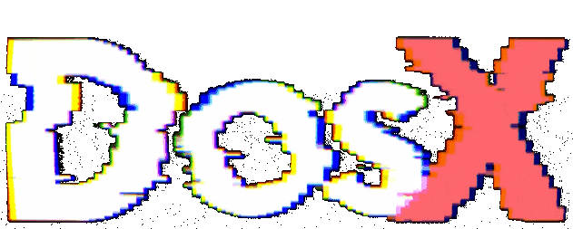

<!--  -->

  

### Contact me: collab@kay-software.ru | [@DosX_dev](https://DosX_dev.t.me/)

Hi all, I'm **DosX**! 👋 (~white hat [**h**/**cr**]acker)
For a long time I was engaged in the development of conventional software for Windows. At the moment, I have expanded my skills and am already developing websites, desktop programs, server software and various protections for them. **I love my job! ❤️** You can view my portfolio below and take a first-hand look at each of the publicly released projects.

-   🖥 [My PC characteristics](my-pc.md)

 

 

 

## My main projects

<table>
  <thead>
    <tr>
      <td></td>
      <td><b>📘 Project</b></td>
      <td><b>⭐ Stars</b></td>
      <td><b>🤝 Forks</b></td>
      <td></td>
      <td><b>📘 Project</b></td>
      <td><b>⭐ Stars</b></td>
      <td><b>🤝 Forks</b></td>
    </tr>
  </thead>

  <tr>
    <td></td>
    <td><a href="https://github.com/DosX-dev/obfus.h">🔒 <b>obfus.h</b></a></td>
    <td></td>
    <td></td>
    <td></td>
    <td><a href="https://github.com/DosX-dev/Astral-PE">🛰️ <b>Astral-PE</b></a></td>
    <td></td>
    <td></td>
  </tr>

  <tr>
    <td></td>
    <td><a href="https://github.com/DosX-dev/PEBLoader.h">👁‍🗨 <b>PEBLoader.h</b></a></td>
    <td></td>
    <td></td>
    <td></td>
    <td><a href="https://github.com/DosX-dev/MemCleaner">🧹 <b>MemCleaner</b></a></td>
    <td></td>
    <td></td>
  </tr>

  <tr>
    <td></td>
    <td><a href="https://github.com/DosX-dev/TinySnake-game">🐍 <b>Tiny Snake game</b></a></td>
    <td></td>
    <td></td>
    <td></td>
    <td><a href="https://github.com/DosX-dev/PE-LiteScan">🔍 <b>PE-LiteScan (PELS)</b></a></td>
    <td></td>
    <td></td>
  </tr>

  <tr>
    <td></td>
    <td><a href="https://github.com/DosX-dev/UAC-Exploit">🚨 <b>UAC-Exploit</b></a></td>
    <td></td>
    <td></td>
    <td></td>
    <td><a href="https://github.com/DosX-dev/FindEXEC">🔎 <b>FindEXEC</b></a></td>
    <td></td>
    <td></td>
  </tr>

  <tr>
    <td></td>
    <td><a href="https://github.com/DosX-dev/BatchToApp">📦 <b>BatchToApp</b></a></td>
    <td></td>
    <td></td>
    <td></td>
    <td><a href="https://github.com/DosX-dev/x16Calc">🧮 <b>x16Calc</b></a></td>
    <td></td>
    <td></td>
  </tr>

  <tr>
    <td></td>
    <td><a href="https://github.com/DosX-dev/NET-MalwareCryptor">🛡️ <b>NET-MalwareCryptor</b></a></td>
    <td></td>
    <td></td>
    <td></td>
    <td><a href="https://github.com/DosX-dev/WebSafeCompiler">🌐 <b>WebSafeCompiler</b></a></td>
    <td></td>
    <td></td>
  </tr>

  <tr>
    <td></td>
    <td><a href="https://github.com/DosX-dev/UPX-Patcher">🛠️ <b>UPX-Patcher</b></a></td>
    <td></td>
    <td></td>
    <td></td>
    <td><a href="https://github.com/DosX-dev/LetsBeFriends-Trojan">🕵️ <b>LetsBeFriends Trojan</b></a></td>
    <td></td>
    <td></td>
  </tr>

  <tr>
    <td></td>
    <td><a href="https://github.com/DosX-dev/braux">🧠 <b>braux</b></a></td>
    <td></td>
    <td></td>
    <td></td>
    <td><a href="https://github.com/DosX-dev/cpuid-in-C">🖥️ <b>CPUID in C</b></a></td>
    <td></td>
    <td></td>
  </tr>

  <tr>
    <td></td>
    <td><a href="https://github.com/DosX-dev/DotNET_XorCryptor">🔐 <b>XorCryptor (XorPack)</b></a></td>
    <td></td>
    <td></td>
    <td></td>
    <td><a href="https://github.com/DosX-dev/BatchASM">📝 <b>BatchASM</b></a></td>
    <td></td>
    <td></td>
  </tr>

  <tr>
    <td></td>
    <td><a href="https://github.com/DosX-dev/FastTweak">⚡ <b>FastTweak</b></a></td>
    <td></td>
    <td></td>
    <td></td>
    <td><a href="https://github.com/DosX-dev/HTML-Guard">🛡️ <b>HTML Guard</b></a></td>
    <td></td>
    <td></td>
  </tr>

  <tr>
    <td></td>
    <td><a href="https://github.com/DosX-dev/PassByCode">🔑 <b>PassByCode</b></a></td>
    <td></td>
    <td></td>
    <td></td>
    <td><a href="https://github.com/DosX-dev/Zeus-File-Identifier">⚔️ <b>Zeus-File-Identifier</b></a></td>
    <td></td>
    <td></td>
  </tr>

  <tr>
    <td></td>
    <td><a href="https://github.com/DosX-dev/geoblock.js">🌍 <b>geoblock.js</b></a></td>
    <td></td>
    <td></td>
    <td></td>
    <td><a href="https://github.com/DosX-dev/NativeClicker-game">🖱️ <b>Native Clicker game</b></a></td>
    <td></td>
    <td></td>
  </tr>

  <tr>
    <td></td>
    <td><a href="https://github.com/DosX-dev/JustMove-game">🕹️ <b>JustMove game</b></a></td>
    <td></td>
    <td></td>
    <td></td>
    <td><a href="https://github.com/DosX-dev/js-hooker">🔨 <b>JS-Hooker</b></a></td>
    <td></td>
    <td></td>
  </tr>

  <tr>
    <td></td>
    <td><a href="https://github.com/DosX-dev/LiteMark.js">🧩 <b>LiteMark.js</b></a></td>
    <td></td>
    <td></td>
  </tr>
</table>

## Other projects

-   [**Heuristic Analysis in DIE**](https://github.com/horsicq/Detect-It-Easy/blob/master/db/PE/__GenericHeuristicAnalysis_By_DosX.7.sg) — a module for **Detect It Easy** that performs heuristic analysis on PE files. It identifies anomalies, protections, obfuscations, and packers, making it valuable for malware analysis.
-   [**ASM Guard**](https://github.com/DosX-dev/ASM-Guard) — a packer utility designed to compress and obfuscate compiled native code. It protects resources, adds DRM, and packages the code into an optimized loader. The source code is proprietary.
